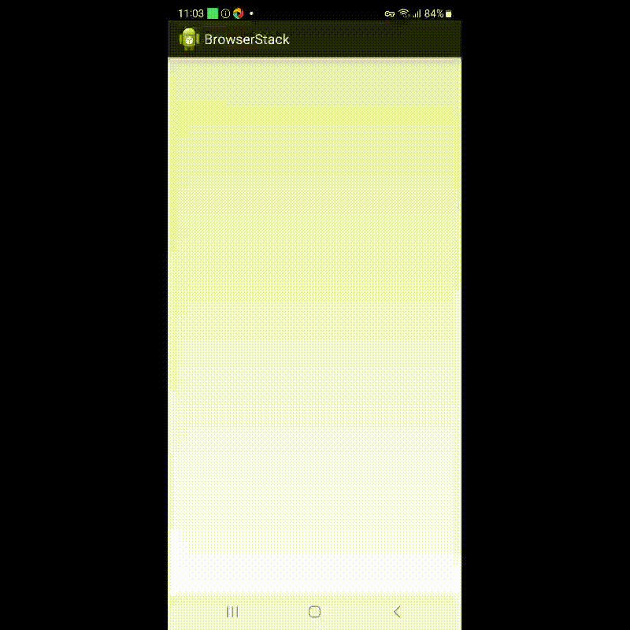

# Wikipedia
## Проект по автоматизации тестирования мобильного приложения

### Настройка устройства
Более подробно можно почитать тут:
<a target="_blank" href="https://autotest.how/appium-setup-for-local-android-tutorial-md">Конспект инструкций по настройке системы и устройств для локального запуска мобильных тестов на платформе Android</a>
### Для локального запуска проекта

1. Клонируйте репозиторий на свой компьютер при помощи git clone
  ```zsh
git clone
  ```
2. Создайте и активируйте виртуальное окружение
  ```zsh
  python -m venv .venv
  source venv/bin/activate
  ```
3. Установите зависимости с помощью pip
  ```zsh
  pip install -r requirements.txt
  ```
4. Включите appium командой:
  ```zsh
  appium --base-path /wd/hub
  ```  
  
#### Далее можно выбрать запускать тесты локально на телефоне или эмуляторе
##### Запуск на личном смартфоне
1. Подключите ваше устройство и включите режим разработчика на нем
2. Используйте данные из команды чтобы заполнить udid в env.local_real_device
  ```zsh
  adb devices
  ```
3. Для запуска используйте команду
  ```zsh
  pytest --context=local_real_device
  ```
4. Для получения allure отчета
  ```zsh
  allure serve allure-results
  ``` 
##### Запуск на эмуляторе
1. Запустите эмулятор через Android studio
2. Используйте данные из команды чтобы заполнить udid в env.local_emulator
  ```zsh
  adb devices
  ```
3. Для запуска используйте команду
  ```zsh
  pytest --context=local_emulator
  ```
4. Для получения allure отчета
  ```zsh
  allure serve allure-results
  ``` 

### Для запуска проекта через browserstack

1. Зарегистрируйтесь на сайте https://app-automate.browserstack.com/
2. Скачайте `.apk` приложение из публичного репозитория. Загрузите его в Browserstack
3. Добавьте ваши "User Name", "Access Key" и ссылку на установленное приложение в файлы env.bstack и env.credentials
4. Для запуска используйте команду 
  ```zsh
  pytest --context=bstack
  ```
5. Для получения allure отчета
  ```zsh
  allure serve allure-results
  ``` 

### При прохождении тестов через Browserstack можно получить видео прохождения тестов
Пример:
<p align="center">
  
</p>